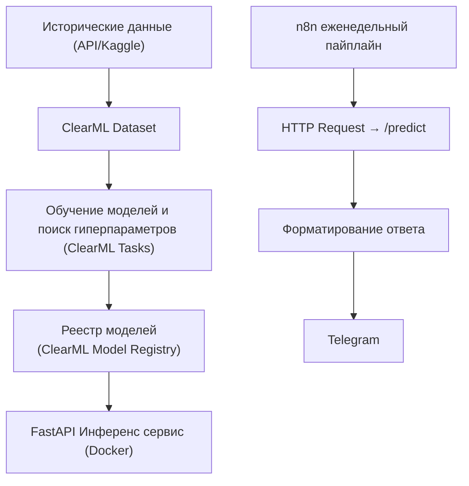
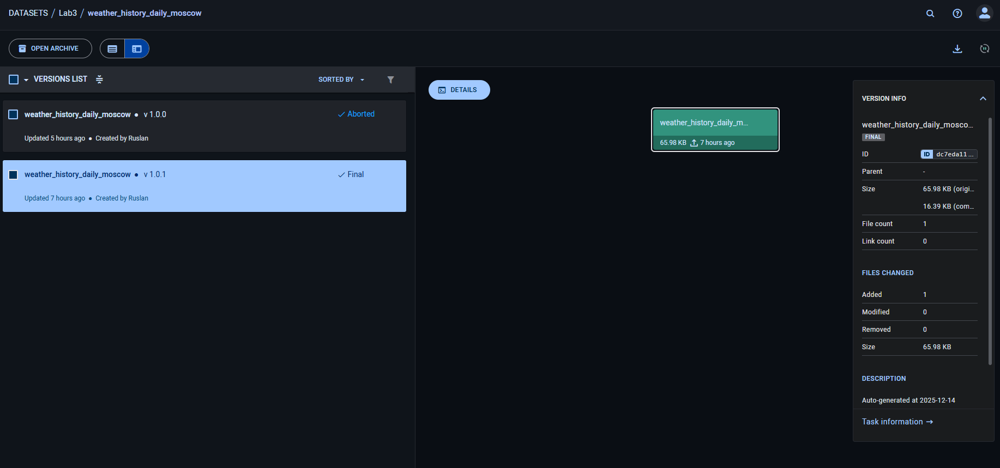
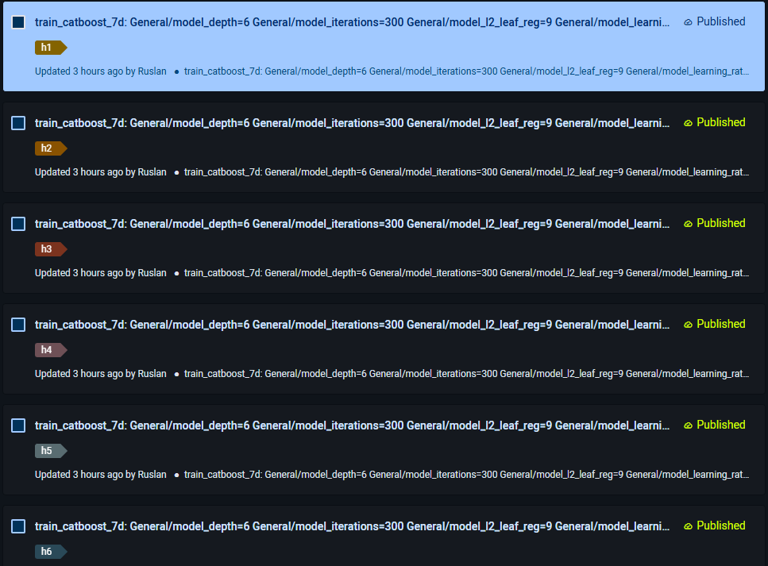
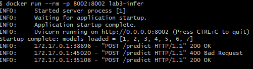
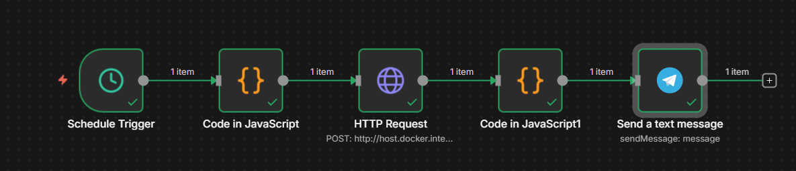
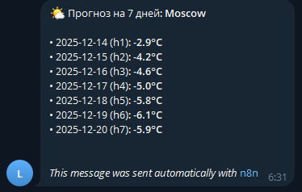

# Отчёт по лабораторной работе №3
# «Построение ML-пайплайна прогнозирования погоды с использованием ClearML, Docker и n8n»
# 1. Цель работы

### Целью лабораторной работы является разработка полного ML-пайплайна для прогнозирования среднесуточной температуры воздуха на горизонте 7 дней, включающего:

 - управление экспериментами и моделями с помощью ClearML;

 - обучение модели с автоматическим подбором гиперпараметров (HPO);

 - регистрацию моделей в Model Registry;

 - реализацию сервиса инференса на FastAPI;

 - упаковку сервиса в Docker;

 - автоматизацию еженедельного запуска прогноза и отправки результатов через n8n и Telegram.

# 2. Архитектура решения

Общая архитектура системы представлена следующим образом:



# 3. Подготовка данных
### 3.1 Источник данных

Используется исторический датасет с ежедневными метеорологическими наблюдениями:

 - город (city);

 - дата (date);

 - минимальная, максимальная и средняя температура;

 - осадки.

Датасет был зарегистрирован в ClearML Dataset, что позволило:

 - версионировать данные;

 - воспроизводить эксперименты;

 - использовать единый источник данных для обучения.

<p align="center">
  
</p>

### 3.2 Инженерия признаков

Для повышения качества модели были использованы следующие признаки:

Календарные признаки:

 - dow — день недели;

 - doy — день года;

 - sin_doy, cos_doy — синусоидальное кодирование сезонности.

Лаговые признаки:

 - temp_avg_lag1;

 - temp_avg_lag7;

 - temp_avg_lag14.

Скользящие агрегаты:

 - temp_avg_rollmean7;

 - temp_avg_rollmean14.

```python
def add_time_features(df: pd.DataFrame) -> pd.DataFrame:
    d = pd.to_datetime(df["date"])
    df["dow"] = d.dt.dayofweek
    df["doy"] = d.dt.dayofyear
    # сезонность
    df["sin_doy"] = np.sin(2 * np.pi * df["doy"] / 365.25)
    df["cos_doy"] = np.cos(2 * np.pi * df["doy"] / 365.25)
    return df

def add_lags(df: pd.DataFrame, col: str, lags=(1, 7, 14), rolls=(7, 14)) -> pd.DataFrame:
    df = df.sort_values(["city", "date"]).copy()
    for lag in lags:
        df[f"{col}_lag{lag}"] = df.groupby("city")[col].shift(lag)
    for w in rolls:
        df[f"{col}_rollmean{w}"] = (
            df.groupby("city")[col].shift(1).rolling(window=w).mean().reset_index(level=0, drop=True)
        )
    return df
```

# 4. Обучение модели
### 4.1 Модель

В качестве основной модели использован CatBoostRegressor, так как он:

 - корректно работает с категориальными признаками (city);

 - устойчив к переобучению;

 - показывает хорошее качество на табличных временных данных.

### 4.2 Горизонт прогнозирования

Использована стратегия Direct Forecasting:

обучается 7 отдельных моделей;

каждая модель прогнозирует свой горизонт:

 - h1 — D+1,

 - h2 — D+2,

 - …

 - h7 — D+7.

### 4.3 Метрики качества

В процессе обучения логировались следующие метрики:

 - MAE — средняя абсолютная ошибка;

 - RMSE — корень среднеквадратичной ошибки;

 - sMAPE — симметричная относительная ошибка.

Также вычислялась агрегированная метрика RMSE_avg_7d.

Все метрики сохранялись в ClearML, что позволило сравнивать эксперименты.

# 5. Поиск гиперпараметров (HPO)

Для улучшения качества модели был выполнен Hyperparameter Optimization:

 - не менее 10 конфигураций;

варьировались параметры:

 - depth,

 - learning_rate,

 - iterations,

 - l2_leaf_reg.

```python
hyper_parameters=[
            UniformIntegerParameterRange("General/model_depth", 4, 10, 1),
            UniformParameterRange("General/model_learning_rate", 0.02, 0.2, 0.01),
            UniformIntegerParameterRange("General/model_iterations", 300, 1200, 100),
            DiscreteParameterRange("General/model_l2_leaf_reg", values=[1, 3, 5, 7, 9]),
        ]
```

По результатам HPO была выбрана лучшая конфигурация, и соответствующие модели были:

 - опубликованы (Publish);

 - зарегистрированы в ClearML Model Registry;

<p align="center">
  
</p>

# 6. Инференс-сервис
### 6.1 FastAPI

Реализован сервис инференса на FastAPI с эндпоинтом:

POST /predict


Вход:
```json
{
  "city": "Moscow",
  "dates": ["D+1", "D+2", ..., "D+7"]
}
```

Выход:
```json
{
  "city": "Moscow",
  "predictions": [
    {"date": "...", "horizon": 1, "temp_avg": ...},
    ...
    {"date": "...", "horizon": 7, "temp_avg": ...}
  ]
}
```

### 6.2 Загрузка моделей

При старте сервиса:

 - выполняется запрос к ClearML Model Registry;

 - выбираются опубликованные модели model_h1 … model_h7;

 - модели автоматически скачиваются с ClearML FileServer;

 - загружаются в память сервиса.

```python

prod_models = Model.query_models(only_published=True, project_name="Lab3")

selected: Dict[int, Model] = {}
for m in prod_models:
    h = _extract_horizon_from_name(getattr(m, "name", "") or "")
    if h in HORIZONS:
        selected[h] = m

def download_model_file(model_url: str, dst_path: Path) -> Path:
    url = _rewrite_fileserver_url(model_url)

    token = Session().token
    headers = {
        "Authorization": f"Bearer {token}",
        "X-ClearML-Auth-Token": token,
    }

    r = requests.get(url, headers=headers, timeout=60)
    r.raise_for_status()

    dst_path.parent.mkdir(parents=True, exist_ok=True)
    dst_path.write_bytes(r.content)
    return dst_path
```

Таким образом, сервис не содержит моделей внутри образа и всегда использует актуальные версии.

# 7. Docker

Сервис инференса был упакован в Docker-контейнер, что обеспечивает:

 - переносимость;

 - воспроизводимость;

 - возможность интеграции с n8n и другими сервисами.



Контейнер успешно запускается и обслуживает HTTP-запросы к /predict.

# 8. Автоматизация с n8n
### 8.1 Workflow



# 9. Результаты работы

В ходе лабораторной работы:

 - развернут ClearML Server в Docker;

 - создан и использован ClearML Dataset;

 - реализовано обучение с логированием метрик и артефактов;

 - выполнен HPO и отобрана лучшая модель;

 - зарегистрированы 7 production-моделей в Model Registry;

 - реализован и задеплоен FastAPI inference-service;

 - сервис упакован в Docker;

 - настроен автоматический weekly-pipeline в n8n.

